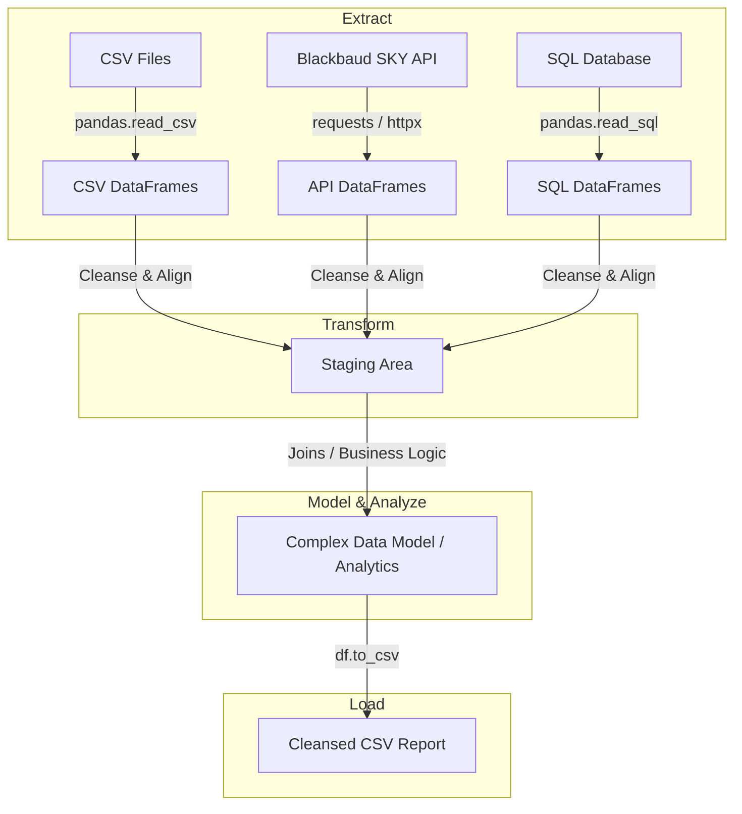

# Python Data Staging Area & Analytics Roadmap

This plan outlines the architecture and a step-by-step learning roadmap for building a data staging area in Python. Because you want to write the code yourself to learn, this document serves as our architectural blueprint and learning syllabus. We will tackle each step sequentially, with me explaining the concepts and you writing the code.

---

## Technical Stack & Architecture

We will use standard, modern Python library choices that are beginner-friendly yet industry-standard for data engineering:

### Proposed Python Libraries
1. **`pandas`**: The industry standard for data manipulation in Python. It handles CSV reading/writing, SQL queries, data merging, cleansing, and analytical calculations extremely well.
2. **`requests`**: A user-friendly library for making HTTP requests to the Blackbaud SKY API.
3. **`python-dotenv`**: For managing Blackbaud API secrets and database credentials securely using an `.env` file instead of hardcoding them.
4. **`sqlalchemy` & DB Driver** (e.g., `pyodbc` for SQL Server, `psycopg2` for PostgreSQL): The standard database toolkit for Python, allowing you to connect to databases and read query results directly.
5. **`pydantic`** *(Optional/Advanced)*: If we want strict schema validation for your data models, but we can start with simple Pandas DataFrames or Dataclasses to keep it beginner-friendly.

---

## User Review Required

Before we begin, please review these key design considerations:

> [!IMPORTANT]
> **Blackbaud SKY API Access**
> To fetch API data, you will need:
> 1. A Blackbaud Developer account.
> 2. An active subscription key (Primary/Secondary).
> 3. API credentials (if using OAuth 2.0 to access live environment data).
> 
> *Note: If you don't have these ready yet, we can start by mocking the API responses or focusing on the CSV portion first.*

> [!NOTE]
> **Learning Strategy**
> Since you want to write the code yourself, we will break the project into small, manageable milestones. For each milestone:
> 1. I will explain the core concepts and give you syntax templates/examples.
> 2. You will write the code in your workspace.
> 3. I will review your code, help debug any errors, and explain *why* things work or how to improve them.

---

## Proposed Roadmap & Phase Checklist

We will work through these phases one by one. You will write the code for each step.

### Phase 1: Environment & Version Control Setup
- Create a Python virtual environment (`venv`) to keep dependencies isolated.
- Create a `requirements.txt` file and install `pandas`, `requests`, and `python-dotenv`.
- Initialize a local Git repository (`git init`).
- Create a secure `.env` file for credentials and configure a `.gitignore` file to ensure sensitive keys, settings, and the virtual environment (`venv/`) are not tracked.
- Create a remote GitHub repository and connect it to your local environment (`git remote add origin`).
- Learn basic Git commands (`git status`, `git add`, `git commit`, `git push`, `git pull`) to track your changes and synchronize your progress between your local computer and your remote machine.

### Phase 2: Ingesting CSV Files
- Learn how to read CSV files using `pandas.read_csv()`.
- Handle common CSV ingestion challenges (different encodings, missing headers, parsing dates correctly).

### Phase 3: Fetching Blackbaud API Data
- Set up a script to authenticate with the Blackbaud SKY API.
- Learn how to request data from endpoints (like Constituents, Gifts, or Actions) and parse the JSON responses.
- Convert the JSON response into a Pandas DataFrame.

### Phase 4: Staging & Transformations (Cleansing)
- Cleanse data from both sources:
  - Standardize column names (lowercase, no spaces).
  - Handle missing or null values (imputing or dropping).
  - Clean/standardize text strings (e.g., phone numbers, postal codes, email formats).
  - Normalize dates to a standard format (`YYYY-MM-DD`).

### Phase 5: Data Modeling & Analytics
- Combine CSV and API data using Pandas joins/merges (similar to SQL `JOIN`).
- Define the metrics and business rules for your data model (e.g., grouping by donor, calculating total lifetime giving, identifying donor segments).
- Apply these calculations to build your analytical views.

### Phase 6: Loading (Exporting)
- Learn how to format and export the cleansed, analyzed dataset to a CSV file using `pandas.DataFrame.to_csv()`.
- Ensure appropriate file naming and error handling.

### Phase 7: SQL Database Integration (Future Scaling)
- Connect Python to your internal database using `sqlalchemy` and the relevant database driver (e.g., `pyodbc` for Microsoft SQL Server or `pg8000`/`psycopg2` for PostgreSQL).
- Add database connection credentials (host, username, password, port, database name) to your `.env` file securely.
- Learn how to write SQL queries directly in Python and ingest the database tables straight into Pandas using `pandas.read_sql()`.
- Incorporate this SQL source into your staging transformations and joins alongside the CSV and API data.

---

## Open Questions

To help tailor the next steps, please let me know:
1. **What kind of CSV files are you planning to ingest?** (e.g., list of offline transactions, event attendees, survey responses).
2. **Which Blackbaud endpoints do you want to query?** (e.g., Constituents, Gifts, Appeals, Campaigns).
3. **What kind of analytics/transformations are you hoping to perform?** (e.g., deduplication, lifetime giving value, matching offline CSV records to online API records).
4. **Do you already have a Blackbaud Developer account and API subscription key?**
